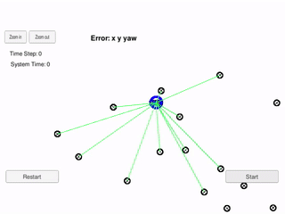

# Kidnapped Vehicle Project

This repository contains my solution for the project "Kidnapped Vehicle Project" of the Udacity Self-Driving Car Engineer Nanodegree Program. A description of a basic setup can be found in the [original repository](https://github.com/udacity/CarND-Kidnapped-Vehicle-Project). The written code could be found in the file [particle_filter.cpp](./src/particle_filter.cpp).

The following part of the README contains a very short writeup which describes what is done.

---

In this project an Particle filter is implemented to predict the location of a car on a map with high accuracy.

In the file [particle_filter.cpp](./src/particle_filter.cpp) the initialization and logic of the particle filter is implemented. On an arriving measurement the prediction for all particles is done and then their weights are updated corresponding to the probability of their predicated and real observations.

The particle filter uses 200 particles.

---

Running the implementation with the [simulator](https://github.com/udacity/self-driving-car-sim/releases) leads to the following results for the Error:

x     | y     | yaw
------|-------|------
0.147 | 0.131 | 0.007

These results show that the particle filter is able to track the car with high accuracy. Using more particles will result in a lower error, using less in a higher one.

# Build & Run

### Dependencies

* cmake >= 3.5
* make >= 4.1 (Linux, Mac), 3.81 (Windows)
* gcc/g++ >= 5.4

### Basic Build Instructions

1. Clone this repo.
2. Make a build directory: `mkdir build && cd build`
3. Compile: `cmake .. && make`
4. Run it: `./particle_filter`
